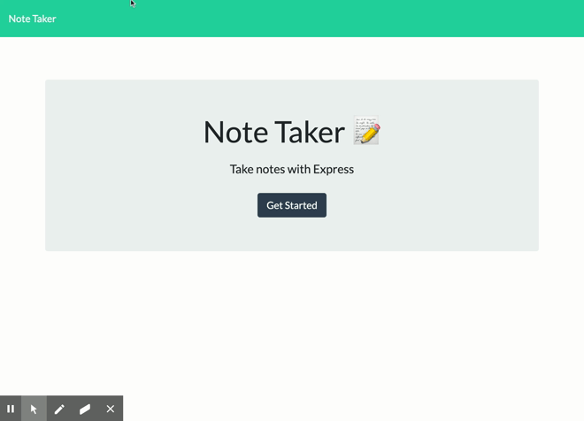

# Note-Taker
  This is an application that can be used to write, save, and delete notes. This application will use an express backend and save and retrieve note data from a JSON file.

## Description:
  This is a web application that can write, save, and delete notes. This application uses an express backend and retrieves/saves notes from a JSON file.

## Table of Contents
  - [Installation](#Installation)
  - [Usage](#Usage)
  - [License](#License)
  - [Contributing](#Contributing)
  - [Tests](#Tests)
  - [Questions](#Questions)

## Installation
  Clone the repository and on the command line run 'npm install' to install the required modules. Next, simply run 'npm start' and the "server" will start listening on port 3000. Open a browser and go to 'http://localhost:3000/' to get to the web application.
  Once the application loads, click the Get Started button to get to the Notes page.

## Usage
  The deployed application can be found at https://enigmatic-tor-32580.herokuapp.com/.
  This application is used to write, save, and delete notes.
  Once on the Notes page, the left side of the page will show the list of notes (if any). On the right side of the page, you will have the space to enter the details of the note.
  After entering a note, there will be a Save button in the top right corner. Once saved, the new note will be shown in the list on the left.
  Notes can be deleted by clicking the trashcan beside the note.

## License
  No license

## Contributing
  This project isn't accepting any other contributions.

## Questions

[GitHub Profile](https://github.com/AllAroundD/)

-If you have any questions, please contact me at [dougmoore@use.startmail.com](mailto:dougmoore@use.startmail.com?subject=[GitHub]%20Source%20Question).
